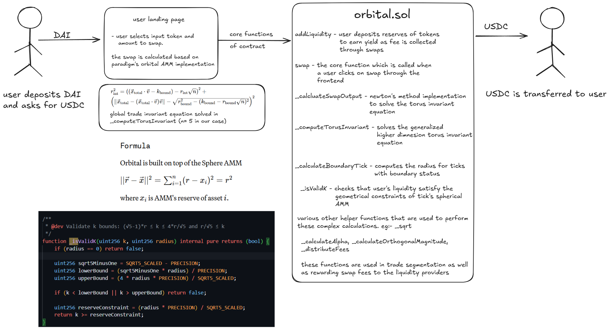

\<div align="center"\>

# Orbital Pool AMM 🌌

### The Next Generation of N-Dimensional Concentrated Liquidity

\</div\>

> **Orbital Pool isn’t just another AMM, it’s a paradigm shift. The future holds a million stablecoins. Today's infrastructure isn't ready.**

Orbital is an automated market maker for pools of 2, 3, or 10,000 stablecoins. By bending liquidity into a torus-shaped universe, it unlocks capital efficiency by bringing concentrated liquidity to higher dimensions. This isn’t your usual 2D liquidity grid—it’s an entirely new dimension where LPs can laser-focus around the sacred $1 mark, while still guaranteeing fair prices even if an entire stablecoin implodes to zero.

It’s like **Uniswap V3’s** surgical precision colliding head-on with **Curve’s** bulletproof stability, and the result is something that shouldn’t even exist, but somehow, it does.

**Orbital is the AMM where capital efficiency doesn’t just scale, it warps\!**

-----

### 🎨 Mathematical Visualization

\<p align="center"\>
\
\
\</p\>

-----

### ✨ Key Features

  - **Multi-Token Stability Engine**: Seamlessly trade across three or more stablecoins in a single pool with no more fragmented liquidity.
  - **Warped Concentrated Liquidity**: Liquidity providers can laser-focus capital around $1, achieving maximum efficiency while still keeping markets resilient.
  - **Torus Invariant Model**: A breakthrough mathematical invariant that curves liquidity across dimensions, ensuring fair pricing even in extreme scenarios.
  - **Fusion of Giants (Uniswap × Curve)**: Orbital takes Uniswap V3’s precision and Curve’s stability, merging them into a next-generation AMM.

-----

### 🧠 Mathematical Foundation

The Orbital AMM is built on the principles described in the [Paradigm Orbital Whitepaper](https://www.paradigm.xyz/2025/06/orbital). The core innovation lies in extending concentrated liquidity to higher dimensions using spherical and toroidal geometry.

#### Core Concepts

**1. Sphere AMM Formula**
The base model for a single liquidity position.

\<p align="center"\>
\
\</p\>

  - `r(vector) = (r, r, ..., r)`: The center of the sphere
  - `xᵢ`: The AMM's reserve of asset `i`
  - `r`: The radius of the sphere

**2. Torus Invariant**
The global invariant combines all active liquidity into a single torus (donut shape).

\<p align="center"\>
\
\</p\>

  - **Interior Ticks**: Behave like spheres for normal trading.
  - **Boundary Ticks**: Behave like circles when reserves hit boundaries.

**3. Tick Geometry & Validation**
Each tick is defined by a `radius (r)` and a `plane constant (k)`. The `k`-value must satisfy the constraint:
`k ≥ (r × PRECISION) / SQRT5_SCALED`

-----

### 🏗️ Architecture & User Flow

\<p align="center"\>
\
\</p\>

-----

### 📍 Deployed Contract Addresses (Somnia Testnet)

  - **Orbital AMM Pool**: `0xcc0F44fe3c9350CD8Aa2477e9EC13F673BB287A3`
  - **Mock Tokens (MUSDC)**:
      - `0x35517FBbdC45Be29394dAcf18555953BCBB04Ec8`
      - `0x58b12d91a1d9C84B2Ab5eEA278bC47f19Dc0b972`
      - `0x5c01b4B48c5a7f7FF2A47eB1CF09acB11d5f8182`
      - `0x414d7aac54808a954Acd902Db929CC8E3C8469Df`
      - `0xc169519b792c4dB9343Bb1dA77D1E1835Bf92CD1`

-----

### 🚀 Quick Start

#### Prerequisites

  - [Foundry](https://getfoundry.sh/) installed
  - Node.js 16+
  - Git

#### Backend Setup & Interaction

```bash
# 1. Clone the repository
git clone https://github.com/your-org/orbital-pool.git
cd orbital-pool

# 2. Install dependencies
forge install

# 3. Build the project
forge build

# 4. Run tests
forge test
```

#### CLI Interaction Examples

```bash
# Deploy a new pool and mock tokens
forge script script/DeployAndConfig.s.sol --rpc-url $RPC_URL --private-key $PRIVATE_KEY --broadcast

# Add liquidity to the pool
cast send $POOL_ADDRESS "addLiquidity(uint256,uint256[5])" <RADIUS> <AMOUNTS_ARRAY> --rpc-url $RPC_URL --private-key $PRIVATE_KEY

# Execute a swap
cast send $POOL_ADDRESS "swap(uint256,uint256,uint256,uint256)" <TOKEN_IN_INDEX> <TOKEN_OUT_INDEX> <AMOUNT_IN> <MIN_AMOUNT_OUT> --rpc-url $RPC_URL --private-key $PRIVATE_KEY
```

#### Frontend Setup

```bash
# 1. Install dependencies
npm install

# 2. Start the development server
npm run dev
```

#### Environment Variables

To deploy the smart contracts, create a `.env` file in the project's root directory.

**.env.example**

```bash
PRIVATE_KEY="0x..."
SOMNIA_RPC_URL="https://rpc.somnia.network"
ETHERSCAN_API_KEY="..."
```

  - **PRIVATE\_KEY**: Your deployment wallet's private key. **Do not commit this file.**
  - **SOMNIA\_RPC\_URL**: RPC endpoint for the target network.
  - **ETHERSCAN\_API\_KEY**: Required for automatic contract verification.

-----

### 🎬 Demo & Documentation

  - **Video Demo**: [Watch on YouTube](https://youtu.be/bEDLBLG8E2Y)
  - **Whitepaper Reference**: This implementation is based on the [Paradigm Orbital Whitepaper](https://www.paradigm.xyz/2025/06/orbital).

-----

### 👥 Development Team

  - **[@agrawalx](https://github.com/agrawalx)**
  - **[@guptak12](https://github.com/guptak12)**

-----

### 📄 License

This project is licensed under the **MIT License**.

\<p align="center"\>
\<i\>Built with ❤️ by the Orbital Team\</i\>
\</p\>
